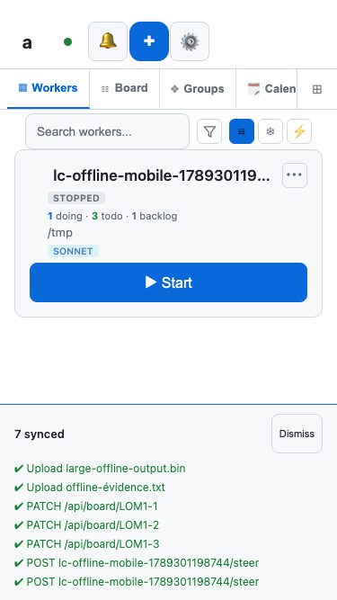
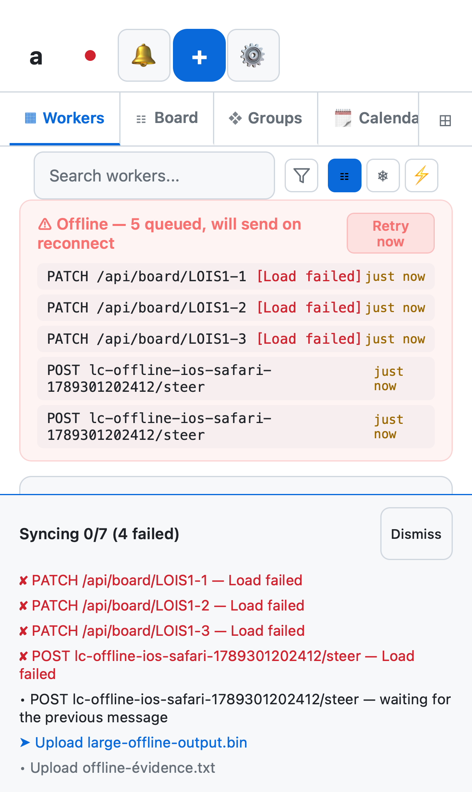
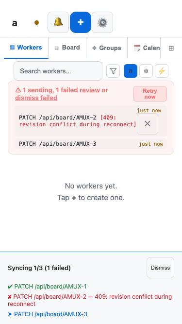

# Offline recovery rerun — September 13, 2026

Overall lifecycle remains **INCOMPLETE**. The selected transport tests pass;
visual acceptance still fails LW-12. Native worker admission remains denied.

The release at `3297d0e468d9c4e9a30857f3e90a85431d9213d2` was pinned after
checking the installed identity, live health commit, and SHA-256 prefix
`bf91fc22b6dff4ac`. All three isolated servers served matching dashboard assets.
The runner used a supplied binary, so its `source_verified` field correctly
remains false: this invocation did not build the release from the checkout.

```bash
AMUX_SESSION=codex-server-sync python3 scripts/lifecycle/run.py browser \
  --binary /path/to/verified/amux-server-release \
  --output /path/to/offline-post-helper-20260913-r2 \
  --grep 'LC-OFFLINE-ROUNDTRIP|LC-SYNC-PROGRESS|LC-RECEIPT'
```

Result: **9 passed, 0 failed, 0 skipped, 0 flaky** across desktop Chromium,
mobile Chromium and iOS WebKit. Outbox contracts: **46 passed, 0 failed**.
The exact command and paths are retained in the private run archive. The
[portable receipt](evidence/lifecycle-offline-2026-09-13.json) records provenance,
scope and the initial incomplete invocation.

Each cold-offline case preserves three board edits, two messages and two files
across reload. Reconnection automatically acknowledges all seven individually;
the 32 MiB plus 17 byte file and Unicode filename match their original hashes.
A second reload produces no replay duplicates. Controlled conflicts remain
reviewable and retry without erasing earlier checkmarks. The receipt scenario
reconciles an acknowledgement before the original HTTP request finishes.
These fixture workers are stopped: server queue acceptance is not native model
consumption, autonomous task completion, or semantic deduplication.

Eight screenshots were opened. Recovered checkmarks fit the phone viewport,
and confirmed history has no extra pending row. The offline/error presentation
still exposes a large panel on Workers, raw HTTP labels, and two differently
scoped pending counts. This is **LW-12**, not a visual pass. The guided acceptance
case now requires modal-only detailed errors and readable, consistently scoped
status; the existing green tests do not assert those requirements yet.






