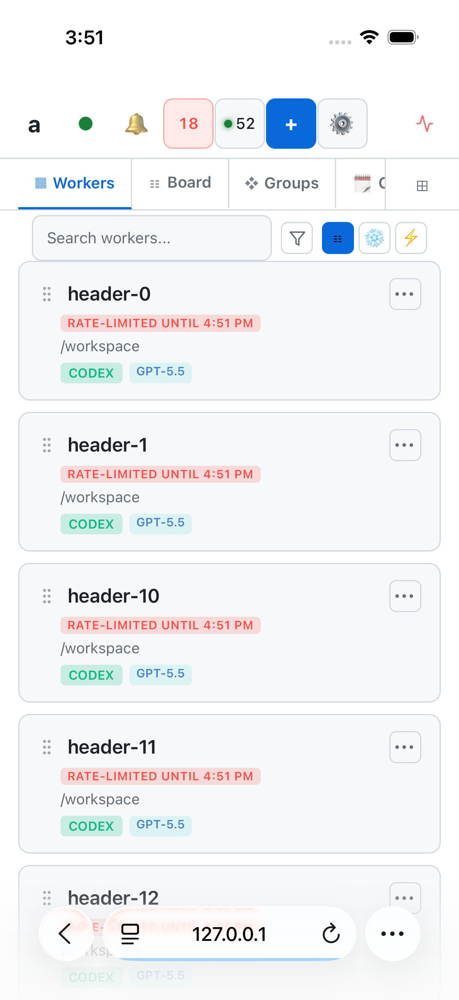

# Mobile header and native Simulator validation

The phone header uses `a`, a connection color dot, a red limited-worker count,
and the active-worker count. All eight controls retain 44-point targets; the
last controls can wrap at 320 pixels; Settings anchors below the actual header. Full connection and limit labels
remain available to assistive technology. Desktop labels remain expanded.

Native Safari initially rendered the generated limited-count label outside its
button despite the button bounds passing. The final implementation uses a real
count element, and `mobile-header-clipped` measures its containment as well as
control and clipping-ancestor bounds (`measured`, `n_considered`, clipped IDs).

## Evidence collected on September 12, 2026

- Native iOS 26.5 / iPhone 17, obtained from Simulator runtime discovery (not
  Safari's frozen user agent). `node scripts/test-ios-browser.mjs` → `RESULT:
  12 passed, 0 failed`. This run used the isolated test API build
  `5c158f091d1eba15` (keyboard correction above `e48bc2a8`) and candidate dashboard assets. The screenshot above was
  visually inspected after fixing the native-only count clipping.
- `npx playwright test --config scratch/ios-simulator-review/playwright-header.config.ts`
  with `AMUX_E2E_DASHBOARD_SOURCE`, `AMUX_E2E_DASHBOARD_CSS`, and
  `AMUX_E2E_DASHBOARD_HTML` pointing at the integration candidate → `1 passed`.
  Widths: 320, 375, 402; loaded fixture: 52 workers, 18 limited. Settings and Add
  open; all header controls fit and have 44-point targets. A forced clipping
  negative control proves the diagnostic detects ancestor clipping.
- `npm run test:state` → 27 passed, 0 failed.
- `npm run test:outbox` → 10 passed, 0 failed.
- `node --test tests/dashboard-outage-recovery.mjs` → 46 passed, 0 failed on
  the integration candidate, preserving the upstream offline checklist and
  per-operation acknowledgements.
- `npm run lint:spa` → 0 errors, 48 existing warnings; state bundle freshness passes.
- Workspace/all-target Clippy → exit 0. Dashboard assets → 38 passed; diagnostic
  contract → 4 passed; browser error causes → 3 passed. Focused iOS API unit tests → 7 passed;
  Tailnet auth unit tests → 3 passed; read-only steering identity query → 1 passed.

## Coverage limits and remaining work

The native 12-probe run covers real text editing, key dispatch, clicking,
scrolling, back navigation, screenshot/state, backend selection, owner/device
refusals, receipt recovery, duplicate display identity, safe uncertain-send
reload recovery (zero command POSTs), the loaded header menus, and exact board creation/detail/reload persistence. Fault cases
use an isolated proxy; they do not drive production workers. Its service worker
is disabled for deterministic fault injection, so this run does not verify
cold offline PWA startup.

A separate native walkthrough reached 20 top-level views without page overflow
or clipped header controls. This is navigation coverage, not proof of each
view's functionality or a completed aesthetic audit. That walkthrough exposed a keyboard-covered Save tap that inserted J instead
of saving. The corrected native baseline dismisses Safari’s input-toolbar
Done control, confirms the keyboard is absent, relocates and hit-tests Save,
and verifies one server card with the exact title and note after reload.
Its regression first failed on e48bc2a8; seven focused Rust tests and the
12 native probes now pass. The measured keyboard_blocks_page_tap warning
was observed in the isolated server log. Terminal touch
scrolling, the full canonical lifecycle matrix, physical-device behavior,
background suspension, live provider actions and production deployment remain
unverified. AF-733 retains the terminal investigation; the broader lifecycle audit remains open; this report does not close it.

## Integration scope

The candidate starts at `fb7d746c`, preserving deployed interaction receipts,
upstream retention of uncertain sends, cold-offline recovery, upload syncing,
composer draft revision checks, and the per-operation reconnect checklist.
Conflict resolutions add transport identity and safe GET receipt retries to
those paths; they do not restore deleted uncertain sends or success toasts for
unacknowledged commands. `APP_VER` and service-worker cache both use 0.9.924.

The Simulator driver installation is supervised separately with
`scripts/ios-browser-driver.sh install-agent`. The same-owner Tailnet bootstrap
is opt-in; it grants no access based on forwarded headers or a member cookie.
No credentials or real owner links belong in this report. A committed candidate
is not a claim that production has adopted it.
